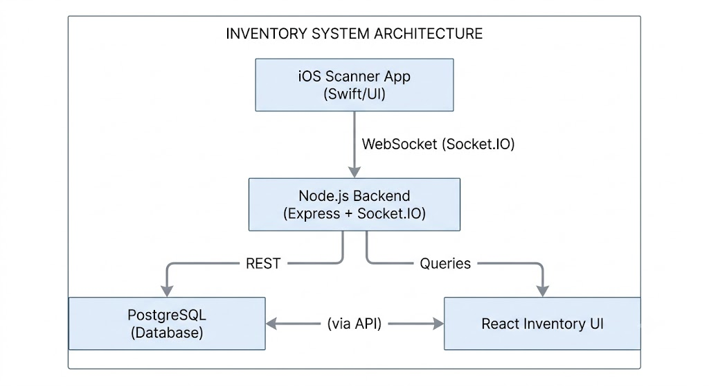

# Inventory Management System

A full-stack inventory management system that uses barcode scanning to track clothing stock in real time, record sales, and manage users — all from a browser-based dashboard.

---

<!-- DEMO GIF/VIDEO PLACEHOLDER -->
<!-- Replace this comment with a gif or video embed, e.g.: -->
<!--  -->

---

## Background

Built for a family-owned small business to digitize their inventory workflow. Previously managed with pen and paper, now processes 50–100 items with real-time scan-to-record capability.

---

## Architecture

<!--  -->

---

## Features

- Real-time barcode scanning (Code128/QR) via hardware scanner over WebSocket
- Instant Socket.IO data transmission from mobile scanner to inventory dashboard
- Stock tracking: scan to add items, remove units, view full inventory with images
- Per-item image management — image uploaded once on first scan of a new prefix, reused for all subsequent units
- Sales recording with quantity, price per unit, sale method (cash, credit card, electronic payment), and automatic total calculation
- Sales history page with full item details (barcode, image, size, price, seller, timestamp) and live search/filter
- Inventory auto-filters sold units — sold items are hidden from stock view without being deleted from the database
- Scanner connection panel with live QR code for mobile device pairing and real-time connection status indicator
- User authentication with session-based login and role-based access (admin / user)
- Admin panel: create, edit (email, password, role), and delete user accounts
- Multi-device scanner support via Socket.IO with backend deduplication on barcode
- Mobile-responsive UI with traditional POS-style design

---

## Tech Stack

- **Mobile:** iOS (Swift), Socket.IO client
- **Backend:** Node.js, Express, Socket.IO, PostgreSQL
- **Frontend:** React
- **Communication:** WebSocket (Socket.IO) + Server-Sent Events (SSE)
- **Database:** PostgreSQL

---

## Demo

Live demo (web only): [link placeholder]

Full system demo with hardware scanner: [link placeholder]

> **Note:** Complete scanner integration requires a local WebSocket connection with a hardware device on the same network.

---

## Installation

### Prerequisites

- Node.js 18+
- PostgreSQL (with a database named `inventory_db` and a schema named `inventory_schema`)

### 1. Database

Create the database and user, then run the schema setup:

```sql
CREATE USER inventory_admin WITH PASSWORD '12345';
CREATE DATABASE inventory_db OWNER inventory_admin;

-- Connect to inventory_db, then:
CREATE SCHEMA inventory_schema AUTHORIZATION inventory_admin;

CREATE TABLE inventory_schema.clothing_images (
  prefix    VARCHAR PRIMARY KEY,
  image_url TEXT NOT NULL
);

CREATE TABLE inventory_schema.clothing_items (
  id           SERIAL PRIMARY KEY,
  barcode      VARCHAR UNIQUE NOT NULL,
  image_prefix VARCHAR NOT NULL REFERENCES inventory_schema.clothing_images(prefix),
  type_code    CHAR NOT NULL,
  style_code   CHAR NOT NULL,
  texture_code CHAR NOT NULL,
  size         VARCHAR NOT NULL,
  unit_number  INTEGER NOT NULL,
  created_at   TIMESTAMPTZ DEFAULT NOW()
);

CREATE TABLE inventory_schema.users (
  id         SERIAL PRIMARY KEY,
  username   VARCHAR(50) UNIQUE NOT NULL,
  password   TEXT NOT NULL,
  email      VARCHAR(255) UNIQUE NOT NULL,
  type       VARCHAR(10) NOT NULL DEFAULT 'user' CHECK (type IN ('admin','user')),
  created_at TIMESTAMPTZ NOT NULL DEFAULT NOW()
);

CREATE TABLE inventory_schema.sales (
  id               SERIAL PRIMARY KEY,
  clothing_item_id INTEGER NOT NULL REFERENCES inventory_schema.clothing_items(id),
  quantity         INTEGER NOT NULL DEFAULT 1 CHECK (quantity > 0),
  price_per_unit   NUMERIC(10,2) NOT NULL CHECK (price_per_unit >= 0),
  total_price      NUMERIC(10,2) GENERATED ALWAYS AS (quantity * price_per_unit) STORED,
  sale_method      VARCHAR(20) NOT NULL CHECK (sale_method IN ('cash','credit_card','electronic_payment')),
  sold_by          INTEGER REFERENCES inventory_schema.users(id) ON DELETE SET NULL,
  sold_at          TIMESTAMPTZ NOT NULL DEFAULT NOW()
);
```

Seed a default admin user (password: `admin123`):

```sql
INSERT INTO inventory_schema.users (username, password, email, type)
VALUES ('admin', '$2b$10$75nVrL4E2zh0Ua2tYrb4EeiORqnYjx/XRZQqyd.LRGhUYuqxuWlKq', 'admin@inventory.local', 'admin');
```

### 2. Backend

```bash
cd server
npm install
node index.js
# Runs on http://localhost:8080
```

### 3. Frontend

```bash
cd inventory-ui
npm install
npm start
# Runs on http://localhost:3000
```

### Barcode Format

Barcodes follow a 7+ character format: `ABCDM01`

| Part | Example | Meaning |
|------|---------|---------|
| `ABC` | prefix | Type (`A`) + Style (`B`) + Texture (`C`) |
| `D` | separator | Fixed marker, always `D` |
| `M` | size | XS / S / M / L / XL / 2XL … |
| `01` | unit number | 01–99, unique per size within a prefix |

Valid examples: `BBKDM12`, `LLCDXL93`, `AACDS12`
